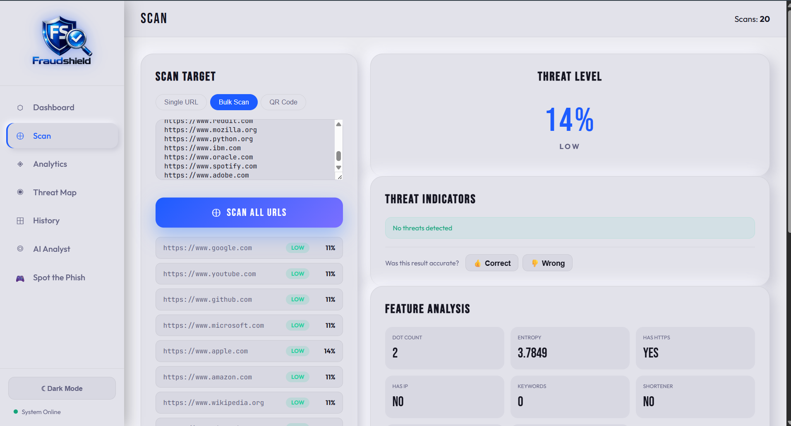
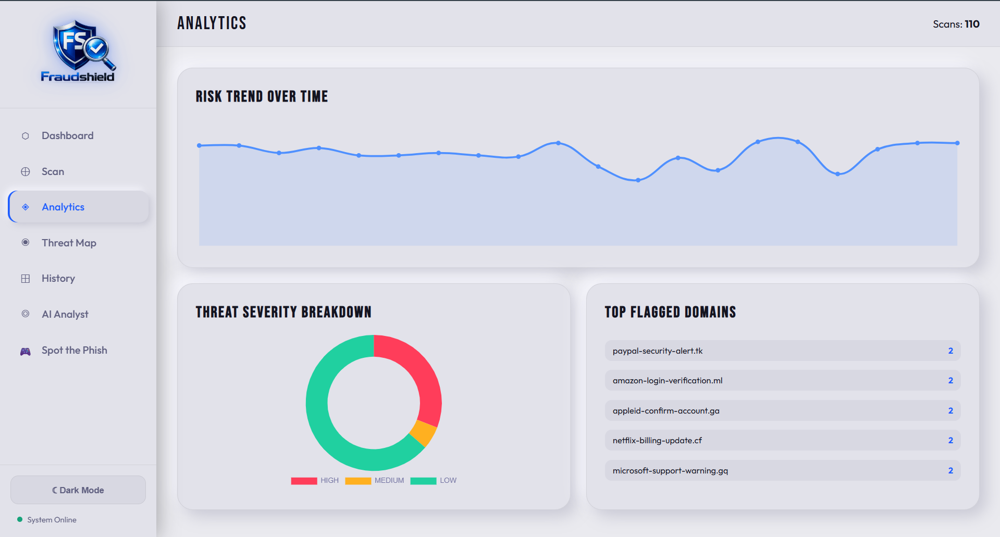
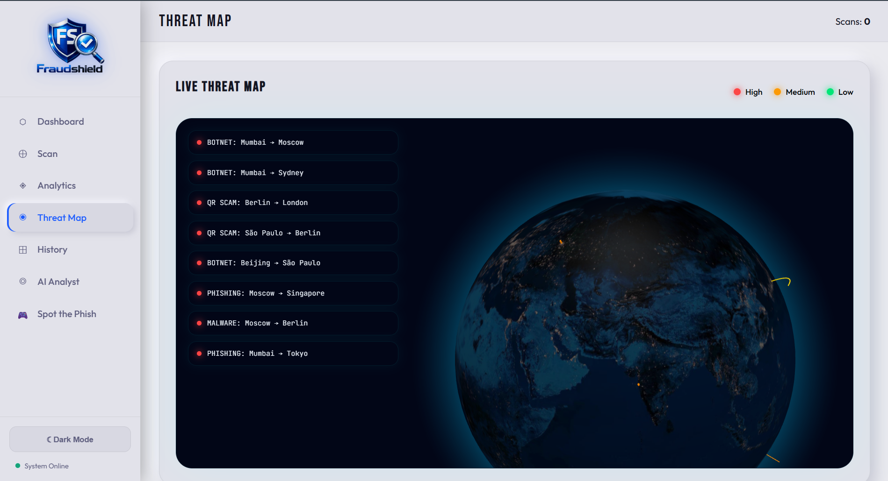
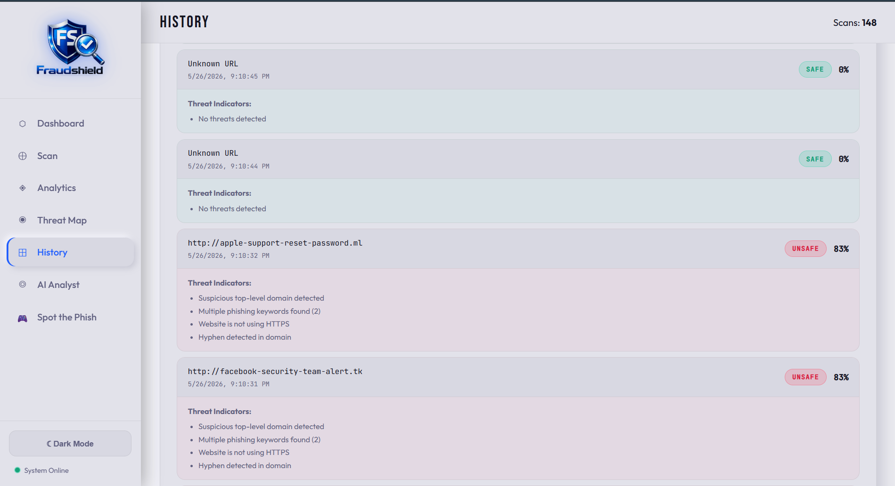
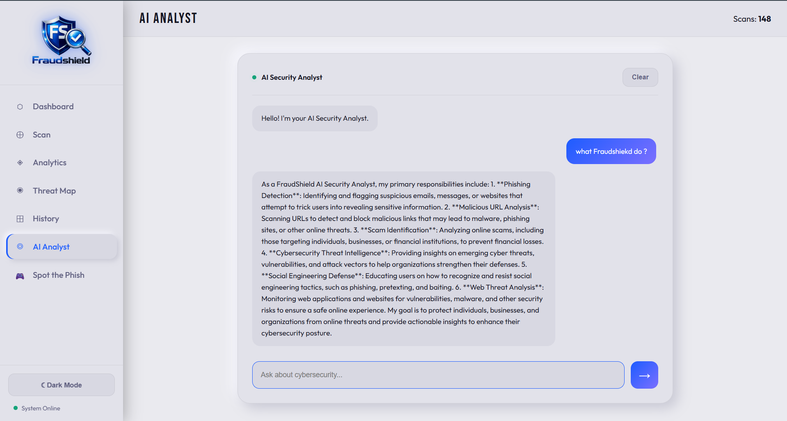
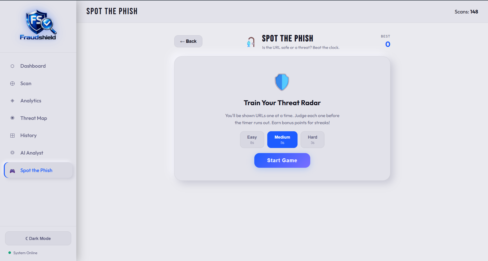

<div align="center">

# 🛡️ FraudShield

[](https://git.io/typing-svg)

### AI-powered phishing detection platform built with Flask & Machine Learning

*Scan single or bulk URLs, visualize cyber threats in real time, analyze suspicious websites, and improve phishing awareness through an interactive security dashboard.*

<br>


<br>

**[🚀 Features](#-features)** • **[📸 Screenshots](#-screenshots)** • **[🛠 Tech Stack](#-tech-stack)** • **[⚙️ Installation](#%EF%B8%8F-installation)** • **[📂 Project Structure](#-project-structure)** • **[🗺 Roadmap](#-future-roadmap)**

</div>

---

# 📌 Overview

**FraudShield** is an AI-powered cybersecurity platform that detects phishing websites using Machine Learning.

The system analyzes URLs using a trained **Random Forest Classifier**, extracting multiple security-related features to classify links as **Safe** or **Phishing**.

Beyond simple prediction, FraudShield provides a complete cybersecurity dashboard featuring analytics, live threat visualization, AI-powered assistance, QR code scanning, phishing awareness training, and historical scan tracking.

---

# 🚀 Features

<table>
<tr>

<td width="50%">

### 🔍 URL Threat Scanner

Detect malicious and phishing URLs instantly.

- Single URL scanning
- Bulk URL scanning
- QR Code Scanner
- Detailed threat breakdown
- Risk score generation

</td>

<td width="50%">

### 📊 Analytics Dashboard

Interactive security analytics powered by Chart.js.

- Threat statistics
- Scan activity
- Risk trends
- Category distribution
- Security insights

</td>

</tr>

<tr>

<td>

### 🌍 Live Threat Map

Visualize cyber threats across the globe.

- Global attack visualization
- Live threat indicators
- Geographic attack distribution

</td>

<td>

### 🤖 AI Security Analyst

Built-in AI chatbot for cybersecurity assistance.

- Explain phishing results
- Security awareness
- Safe browsing recommendations
- Cybersecurity education

</td>

</tr>

<tr>

<td>

### 🕒 Scan History

Track every scan with timestamps.

- Previous scans
- Threat history
- Detailed reports
- Search & filtering

</td>

<td>

### 🎮 Spot The Phish

Interactive phishing awareness game.

- Detect fake URLs
- Improve cybersecurity skills
- Score tracking
- Time challenge

</td>

</tr>

</table>

---

# 📸 Screenshots

> Replace these placeholder images with actual screenshots.

| URL Scanner | Analytics Dashboard |
|-------------|---------------------|
|  |  |

| Live Threat Map | Scan History |
|-----------------|--------------|
|  |  |

| AI Security Analyst | Spot The Phish |
|---------------------|----------------|
|  |  |

---

# 🛠 Tech Stack

| Category | Technologies |
|----------|--------------|
| **Backend** | Flask, Python |
| **Machine Learning** | Scikit-Learn, Pandas, NumPy |
| **Frontend** | HTML5, CSS3, JavaScript |
| **Charts** | Chart.js |
| **Database** | SQLite |
| **Model** | Random Forest Classifier |

---

<details>

<summary><b>🧠 Machine Learning Workflow</b></summary>

### 1️⃣ Data Collection

Extract URL-based phishing features.

### 2️⃣ Data Preprocessing

Clean and normalize the dataset.

### 3️⃣ Feature Engineering

Generate phishing indicators such as:

- URL Length
- HTTPS Status
- Number of Dots
- Number of Hyphens
- Presence of IP Address
- Suspicious Characters
- Domain Information

### 4️⃣ Model Training

Train a **Random Forest Classifier** on labeled phishing data.

### 5️⃣ Prediction

Predict whether a URL is:

- ✅ Safe
- ❌ Phishing

### 6️⃣ Dashboard Visualization

Display prediction results with charts and analytics.

</details>

---

# ⚙️ Installation

## 1. Clone Repository

```bash
git clone https://github.com/tusharmagar1/FraudShield.git
cd FraudShield
```

---

## 2. Create Virtual Environment

### Windows

```bash
python -m venv venv
venv\Scripts\activate
```

### macOS / Linux

```bash
python3 -m venv venv
source venv/bin/activate
```

---

## 3. Install Dependencies

```bash
pip install -r requirements.txt
```

---

## 4. Run Application

```bash
python app.py
```

---

## 5. Open Browser

```
http://127.0.0.1:5000
```

---

# 📂 Project Structure

```text
FraudShield
│
├── assets/
│   ├── scan-dashboard.png
│   ├── analytics-dashboard.png
│   ├── threat-map.png
│   ├── history-page.png
│   ├── ai-analyst.png
│   └── spot-the-phish.png
│
├── instance/
│   └── database.db
│
├── static/
│   ├── css/
│   ├── js/
│   └── images/
│
├── templates/
│   ├── index.html
│   ├── dashboard.html
│   └── history.html
│
├── model.pkl
├── app.py
├── requirements.txt
└── README.md
```

---

# 📈 Future Roadmap

- [ ] Live threat monitoring
- [ ] Email phishing detection
- [ ] Browser extension
- [ ] User authentication
- [ ] Cloud deployment
- [ ] REST API
- [ ] Mobile application
- [ ] Deep Learning threat detection
- [ ] Real-time notifications
- [ ] Threat intelligence integration

---

# 🤝 Contributing

Contributions are welcome!

1. Fork the repository

2. Create your feature branch

```bash
git checkout -b feature/AmazingFeature
```

3. Commit your changes

```bash
git commit -m "Add AmazingFeature"
```

4. Push to GitHub

```bash
git push origin feature/AmazingFeature
```

5. Open a Pull Request

---

# 💡 Contribution Ideas

- UI/UX Improvements
- Machine Learning Enhancements
- Dataset Expansion
- Security Features
- Performance Optimization
- Bug Fixes
- Documentation Improvements

---

# 👨‍💻 Author

## Tushar Magar

AI & Machine Learning Enthusiast

GitHub: **https://github.com/tusharmagar1**

---

# ⭐ Support

If you found this project helpful, consider giving it a **⭐ Star** on GitHub.

It helps others discover the project and motivates future development.

---

# 📜 License

This project is licensed under the **MIT License**.

---
<div align="center">

Made with ❤️ using Python, Flask and Machine Learning

</div>
